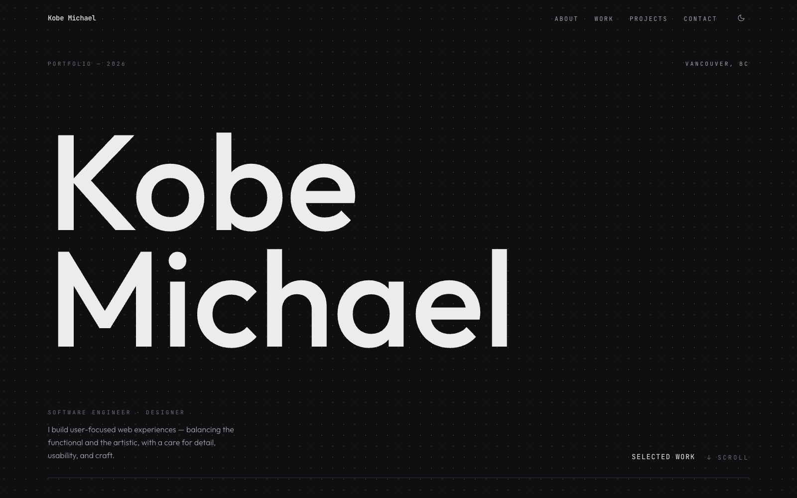
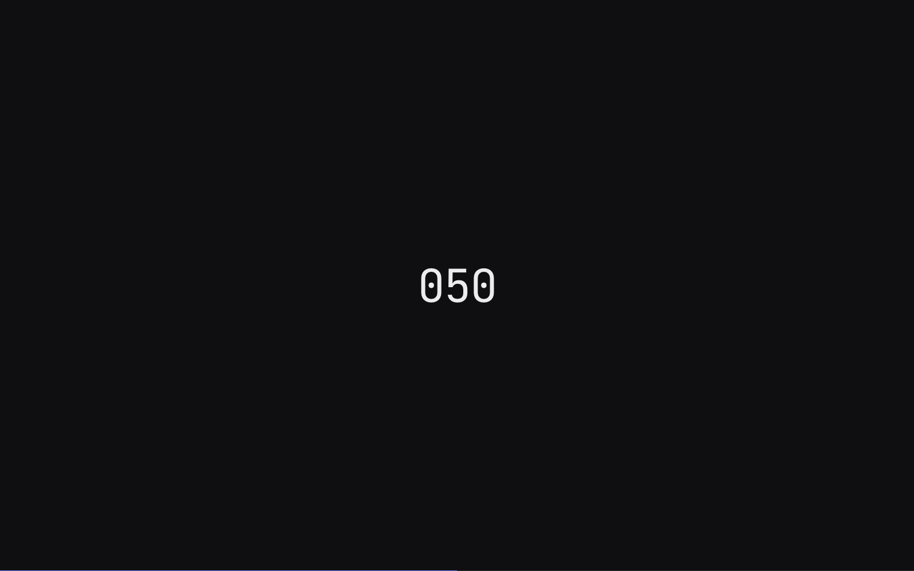
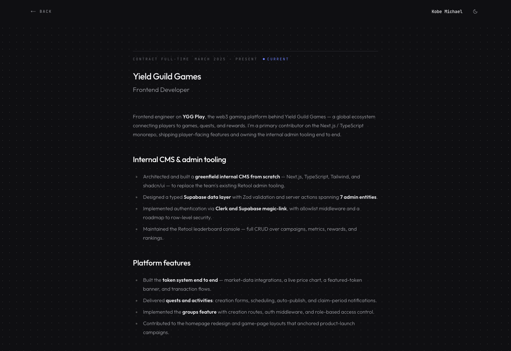

# Kobe Michael — Personal Website

My personal portfolio: an editorial, Swiss-inspired site that showcases my
experience, projects, and interests. This is **v4** — a ground-up redesign
focused on typography, motion, and craft.

🔗 **Live:** [kobemichael.dev](https://www.kobemichael.dev/)



<table>
  <tr>
    <td width="50%"></td>
    <td width="50%"></td>
  </tr>
</table>

## Features

- **Editorial design** — a Swiss-inspired layout with a fine dot grid and an
  ambient gradient backdrop, in dark (default) and light themes.
- **Intro preloader** — an opaque loading overlay with a counting indicator that
  curtains away to a flicker-free hero reveal.
- **Motion** — GSAP-driven entrance and scroll reveals, with Lenis smooth scroll
  on a single shared ticker.
- **3D backdrop** — a subtle ambient gradient rendered with React Three Fiber.
- **Markdown-driven content** — experiences live as local JSON + Markdown files,
  rendered through dynamic routes — no CMS required.
- **Accessible** — fully `prefers-reduced-motion` aware; animations gracefully
  step aside.
- **Responsive** — fluid typography and layout from mobile to ultrawide.

## Tech Stack

- **Framework:** [Next.js 14](https://nextjs.org/) (App Router) + TypeScript
- **Styling:** [Tailwind CSS](https://tailwindcss.com/) with a custom token palette
- **Motion:** [GSAP](https://gsap.com/) + [@gsap/react](https://github.com/greensock/react) and [Lenis](https://lenis.darkroom.engineering/)
- **3D:** [Three.js](https://threejs.org/) via [React Three Fiber](https://docs.pmnd.rs/react-three-fiber) + [drei](https://github.com/pmndrs/drei)
- **Content:** local JSON + Markdown rendered with [markdown-to-jsx](https://github.com/quantizor/markdown-to-jsx)

## Getting Started

Install dependencies and start the dev server (runs on **port 8080**):

```sh
npm install
npm run dev
```

Then open [http://localhost:8080](http://localhost:8080).

```sh
npm run build   # production build
npm run start   # serve the production build
npm run lint    # lint
```

## Project Structure

```
src/
  app/                  # App Router: layout, home page, /experience/[id], /projects/[id]
  components/           # SiteHeader, Preloader, Reveal, sections/, …
  providers/            # ThemeProvider, SmoothScrollProvider (Lenis)
  three/                # AmbientBackdrop (React Three Fiber)
  lib/                  # data access, gsap setup, hooks
public/
  positionsData.json    # work experience metadata
  projectsData.json     # project metadata
  experiences/*.md      # long-form write-up per experience
  projects/*.md         # long-form case study per project
docs/screenshots/       # README imagery
```

## Editing Content

Experience and project content is data-driven — no code changes needed:

- **Add/edit a role:** update [`public/positionsData.json`](public/positionsData.json) and add a matching
  Markdown file in [`public/experiences/`](public/experiences/) (its `markdown` field is the filename).
- **Add/edit a project:** update [`public/projectsData.json`](public/projectsData.json) and add a matching
  Markdown file in [`public/projects/`](public/projects/) (the filename matches the project's `id` field).

---

Feel free to clone or fork it for your own use. ❤️
